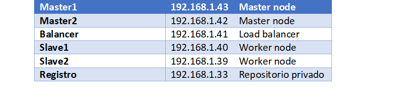
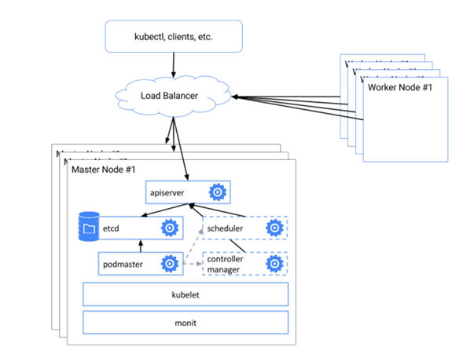
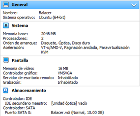
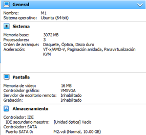
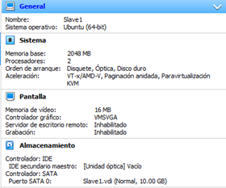
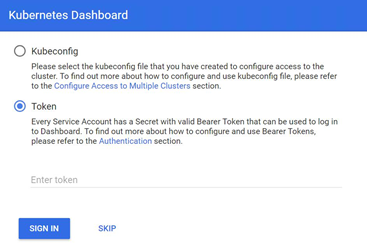
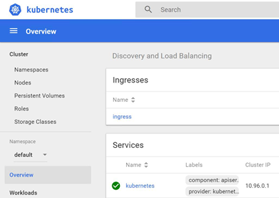

# Kubernetes
## Proyecto de Sistemas Operativo II - Universidad Mariano Galvez

### Arquitectura
Inventario de servidores: 





### Requisitos

Configuración de máquina virtual para nuestro Balancer 
- Le asignamos 10G de disco duro
- Le asignamos 2G de RAM
- Le asignamos 3 Procesador
- Ubuntu 18.4



Configuración de máquinas virtuales para los Masters 
- Le asignamos 10G de disco duro
- Le asignamos 3G de RAM
- Le asignamos 3 Procesadores
- Ubuntu 18.4



Configuración de máquina virtual para los  esclavos
- Le asignamos 10G de disco duro
- Le asignamos 2G de RAM
- Le asignamos 2 Procesador
- Ubuntu 18.4



### Configuración Principal

- Actualizar el sistema operativo:
``` 
sudo apt update && sudo apt -y upgrade
```

- Entrar  como usuario root:
```
sudo su
```

- Instalar los paquetes para permitir que apt use el repositorio HTTPS:
```
apt-get update && apt-get install -y apt-transport-https ca-certificates curl software-properties-common gnupg2 
```

- Agregar la llave GPG oficial de Docker :
```
curl -fsSL https://download.docker.com/linux/ubuntu/gpg | apt-key add -
```

- Agregar el repositorio de docker :
```
add-apt-repository "deb [arch=amd64] https://download.docker.com/linux/ubuntu $(lsb_release -cs) stable"
```

- Instalar Docker CE:
```
apt-get update && apt-get install -y containerd.io=1.2.13-1 \
docker-ce=5:19.03.8~3-0~ubuntu-$(lsb_release -cs) \
docker-ce-cli=5:19.03.8~3-0~ubuntu-$(lsb_release -cs)
```

- Configurar Demonio:
```
cat > /etc/docker/daemon.json <<EOF
{
"exec-opts": ["native.cgroupdriver=systemd"],
"log-driver": "json-file",
"log-opts": {
"max-size": "100m"
},
"storage-driver": "overlay2"
}
EOF
```

- Crear la carptera del servicio de Docker:
```
mkdir -p /etc/systemd/system/docker.service.d
```

- Reiniciar el demonio:
```
systemctl daemon-reload
```

- Reiniciar Docker:
```
systemctl restart Docker
```

- Verificamos el estatus de nuestro Docker
```
systemctl status docker
```

### Instalación Kubernetes

- Agregar la llave GPG oficial de Kubernetes:
```
curl -s https://packages.cloud.google.com/apt/doc/apt-key.gpg | sudo apt-key add -
```

- Agregar el repositorio de Kubernetes:
```
apt-add-repository "deb http://apt.kubernetes.io/ kubernetes-xenial main"
```

- Instalar Kubeadm:
```
apt install -y kubeadm
```

- Verificamos el estatus de Kubernetes:
 ```
 systemctl status kubelet
 ```
 
 ### Configuración del Balancer
 
 - Instalar Nginx:
 ```
 apt install -y nginx
 ```
 
 - Crear una carpeta:
 ```
 mkdir -p /etc/nginx/tcpconf.d
 ```
 
 - Abrir el archivo de NGINX
 ```
 nano /etc/nginx/nginx.conf
 ```
 
 - Agregar la carpeta creada al final del archivo de NGINX:
 ```
 include /etc/nginx/tcpconf.d/*;
 ```
 
 - Agregar configuración de Kuberntes:
 ```
 cat <<EOF | sudo tee /etc/nginx/tcpconf.d/kubernetes.conf
stream {
upstream kubernetes {
server 192.168.1.43:6443;
server 192.168.1.42:6443;
}
server {
listen 6443;
listen 443;
proxy_pass kubernetes;
}
}
EOF
```

- Recargamos los cambios:
```
nginx -s reload
```

- Miramos la IP del balancer:
```
ifconfig
```

- Miramos el estatus del balancer:
```
systemctl status nginx
```

### Levantando el primer maestro

- Apagar la SWAP:
```
swapoff -a
```

- Levantamos nuestro master:
```
kubeadm init --control-plane-endpoint "192.168.1.41:6443" --upload-certs
```

- Generación de tokens:

```
kubeadm join 192.168.1.41:6443 --token br3kl2.fj4zzeeh4q5o45hz \
--discovery-token-ca-cert-hash sha256:dfcf1aef179b857d98c401e324f86a76c27de57471f3c832ab5965f0a64de633 \
--control-plane --certificate-key b524df7a3cf54bffb7ff803af6412726a0fb4aaa3872e4b914b4dc561ac59e14
```

```
kubeadm join 192.168.1.41:6443 --token br3kl2.fj4zzeeh4q5o45hz \
--discovery-token-ca-cert-hash sha256:dfcf1aef179b857d98c401e324f86a76c27de57471f3c832ab5965f0a64de633
```

- Finalizar configuración del master:
```
mkdir -p $HOME/.kube
sudo cp -i /etc/kubernetes/admin.conf $HOME/.kube/config
sudo chown $(id -u):$(id -g) $HOME/.kube/config
```

- Aplicar el complemento CNI de Kubernetes:
```
kubectl apply -f ”https://cloud.weave.works/k8s/net?k8s-version=$(kubectl version | base64 | tr -d '\n')”
```

- Vemos el estado de los pods
``` 
kubectl get pod -n kube-system -w  
kubectl get pods --all-namespaces
```

- Volvemos a ver los estados de los pods:
```
kubectl get pod -n kube-system
```

### Levantando el segundo maestro

- Apagar swap
```
swapoff -a
```

- Copiar Token:
```
kubeadm join 192.168.1.36:6443 --token f244cw.rizof8lfx4hu1tx9 \
--discovery-token-ca-cert-hash sha256:86264cd7d615dc17742c5fdf305eab76a9ae09143bd553e13c580b80b2c6cea7 \
--control-plane --certificate-key e6edb976f294937cd1b5d0cd641c21a7a18e900e284ac81878f34d9ac7dce608
```

- Finalizar configuración del master 2:
```
mkdir -p $HOME/.kube
sudo cp -i /etc/kubernetes/admin.conf $HOME/.kube/config
sudo chown $(id -u):$(id -g) $HOME/.kube/config
```

### Agregar los esclavos

- Apagar swap:
```
swapoff -a
```

- Copiar token:
```
kubeadm join 192.168.1.36:6443 --token g6fmvg.k6wno5ash85s7ayj     --discovery-token-ca-cert-hash sha256:aaeabb43befb7a8ef75d0c0f3eb2e8abb9404122ac94159d8df53bfc17964048
```

### Reset de cluster

- Resetear cluster
```
Kubeadm reset
```

- Borrar archivos de configuración:
```
rm -rf $HOME/.kube/config
sudo sysctl net.bridge.bridge-nf-call-iptables=1
```

- Apagar swap:
```
swapoff -a
```

**Repetir los pasos de levantar para cada miembro del cluster**

### Configuración servidor de imágenes

- modificar archivo openssl:
```
sudo gedit /etc/ssl/openssl.cnf
```

- Agregar la siguiente línea en el archivo:
```
subjectAltName=IP:192.168.1.33  #ip del servidor de imagenes
```

- Descargar imagen de docker registry:
```
sudo docker pull registry:2
```

- Crear carpeta local para almacenar los certificados:
```
mkdir -p /docker_data/certs/
```

- Crear certificados
```
openssl req \
-newkey rsa:4096 -nodes -sha256 -keyout /docker_data/certs/domain.key \
-x509 -days 365 -out /docker_data/certs/domain.crt
```

- En el log de la consola agregar la IP del servidor de imagenes:
```
Common Name (eg, your name or your server's hostname) []:ip-del-servidor
```

- Crear un directorio para almacenar las imagenes de docker:
```
mkdir -p /docker_data/images
```

- Ejecutar un contenedor de docker registry en servidor local:
```
docker run -d -p 5000:5000 \
-v /docker_data/images:/var/lib/registry \
-v /docker_data/certs:/certs \
-e REGISTRY_HTTP_TLS_CERTIFICATE=/certs/domain.crt \
-e REGISTRY_HTTP_TLS_KEY=/certs/domain.key \
--restart on-failure \
--name myregistry \
registry:2
```

- Crear Docker Host:
```
export DOCKER_HOST=tcp://192.168.1.33:5000
```

### Configuración del cliente

- Copiar el archivo `/docker_data/certs/domain.crt`  en la carpeta root de los clientes

- Crear carpeta para aprobar el certificado dentro de `etc/docker/certs.d`:
```
mkdir -p /etc/docker/certs.d/192.168.1.33:5000/ 
```

- Copiar el archivo /root/domain.crt a la carpeta 
```
/etc/docker/certs.d/192.168.1.33:5000/
cp -rf /root/domain.crt /etc/docker/certs.d/192.168.1.33:5000/
```

- Subir imagen al servidor de imagenes
```
docker push 192.168.1.33:5000/imagen:version
```

### Configuración del frontend
  
Configuración del archivo `dockercompose.yaml`

```
nginx-proxy:
image: jwilder/nginx-proxy
restart: always
ports:
"80:80"
"443:443"
volumes:
/var/run/docker.sock:/tmp/docker.sock:ro
/etc/nginx/vhost.d
/usr/share/nginx/html
./certs:/etc/nginx/certs:ro
./nginx-custom.conf:/etc/nginx/conf.d/custom.conf:ro
labels:
com.github.jrcs.letsencrypt_nginx_proxy_companion.nginx_proxy

letsencrypt:
image: jrcs/letsencrypt-nginx-proxy-companion
restart: always
volumes:
./certs:/etc/nginx/certs:rw
/var/run/docker.sock:/var/run/docker.sock:ro
volumes_from:
nginx-proxy:rw

ui:
image: jc21/registry-ui
expose:
"80"
environment:	
REGISTRY_HOST: 192.168.1.33:5000
REGISTRY_SSL: "true"
REGISTRY_DOMAIN: 192.168.1.33
# Tienes que crear este usuario para que ui se pueda conectar al registry con auth
# You gotta create this user for the ui to connect to the registry using auth
REGISTRY_USER: docker
REGISTRY_PASS: pass
REGISTRY_STORAGE_DELETE_ENABLED: "true"
restart: always
links:
registry:192.168.1.33

proxy:
image: nginx
expose:
"80"
environment:
VIRTUAL_HOST: 192.168.1.33
VIRTUAL_PORT: 80
LETSENCRYPT_HOST: 192.168.1.33
LETSENCRYPT_EMAIL: dmonzonr@miumg.edu.gt
volumes:
./proxy.conf:/etc/nginx/conf.d/proxy.conf:ro
depends_on:
ui
registry
nginx-proxy
links:
ui
registry
restart: always

configuracion archivo nginx-custom.conf
# disable any limits to avoid HTTP 413 for large image uploads
client_max_body_size 0;
```

- Configurar archivo `proxy.conf`

```
# Logging
log_format proxy 'http [$time_local] $status $request_method $scheme $host "$request_uri" [Client $remote_addr] [Length $body_bytes_sent] [Time $request_time] "$http_user_agent" "$http_referer"';

upstream registry {
server registry:5000;
}

upstream ui {
server ui:80;
}

## Set a variable to help us decide if we need to add the
## 'Docker-Distribution-Api-Version' header.
## The registry always sets this header.
## In the case of nginx performing auth, the header is unset
## since nginx is auth-ing before proxying.
map $upstream_http_docker_distribution_api_version $docker_distribution_api_version {
'' 'registry/2.0';
}

server {
server_name local;
listen 80 default;

access_log /dev/stdout proxy;

charset utf-8;
proxy_set_header X-Forwarded-Scheme $scheme;
server_tokens off;

# disable any limits to avoid HTTP 413 for large image uploads
client_max_body_size 0;

# required to avoid HTTP 411: see Issue #1486 (https://github.com/moby/moby/issues/1486)
chunked_transfer_encoding on;

location /health {
allow all;
access_log off;
return 200 'OK';
}

# Registry passthrough
location ~ /v2.* {
# Do not allow connections from docker 1.5 and earlier
# docker pre-1.6.0 did not properly set the user agent on ping, catch "Go *" user agents
if ($http_user_agent ~ "^(docker\/1\.(3|4|5(?!\.[0-9]-dev))|Go ).*$" ) {
return 404;
}

## If $docker_distribution_api_version is empty, the header is not added.
## See the map directive above where this variable is defined.
add_header 'Docker-Distribution-Api-Version' $docker_distribution_api_version always;

# kill cache
add_header Last-Modified $date_gmt;
add_header Cache-Control 'no-store, no-cache, must-revalidate, proxy-revalidate, max-age=0';
if_modified_since off;
expires off;
etag off;

proxy_set_header Host              $http_host;
proxy_set_header X-Real-IP         $remote_addr;
proxy_set_header X-Forwarded-For   $proxy_add_x_forwarded_for;
proxy_set_header X-Forwarded-Proto $scheme;
proxy_read_timeout                 900;
proxy_pass https://registry;
}

# Frontend
location / {
# kill cache
add_header Last-Modified $date_gmt;
add_header Cache-Control 'no-store, no-cache, must-revalidate, proxy-revalidate, max-age=0';
if_modified_since off;
expires off;
etag off;

proxy_set_header Host $host;
proxy_pass http://ui;
}
}

```

- Ejecución del docker compose
```
docker-compose up -d
```

### Desplegar pods y app

- Crear nuestro deployment y a la vez bajamos la imagen de docker hub:
```
kubectl create deployment hello-http --image=192.168.1.33:5000/my-hello-world:v1
```

- Ver el estado de los pods:
```
kubectl get pods
```

- Ver los detalles de nuestro despliegue:
```
kubectl describe pod hello-http
```

- Crear un archivo yml:
```
nano app.yml
```

- Agregamos nuestra configuración:
```
apiVersion: v1

kind: Pod

metadata:
name: mi-app
labels:
app: web

spec:
containers:
name: front-end
image: nginx
ports:
containerPort: 80

name: back-end
image: redis
```

- Desplegamos el conjunto de contenedores descritos en el fichero `app.yml`:
```
kubectl apply -f app.yml
```

-Exponemos nuestro servicio 
```
kubectl expose deployment hello-http --type=LoadBalancer --port=80
```

- Vemos nuestros servicios Activos
```
kubectl get services
```

- Para cambiar o agregar el número de replicas que queremos:
```
kubectl scale deployment --replicas=3 hello-http
```

- Eliminamos el despliegue de la imagen `httpd:latest`:
```
kubectl delete deployment hello-http
```

- Eliminamos el despliegue hecho con el fichero `app.yml`:
```
kubectl delete -f app.yml
```

- Eliminamos el servicio expuesto `hello.http`:
```
kubectl delete service hello-http
```

### Desplegar dashboard

- Deploying de Dashboard para la interfaz
```
kubectl apply -f https://raw.githubusercontent.com/kubernetes/dashboard/v2.0.0-beta8/aio/deploy/recommended.yaml
```

- Creamos el archivo dashboar-admin.yml, para el Rol
```
nano dashboar-admin.yml
```

- Agregamos la configuración al archivo `dashboar-admin.yml`:
```
apiVersion: v1
kind: ServiceAccount
metadata:
name: admin-user
namespace: kube-system
```

- Aplicamos el archivo de configuración a kubernetes, para el rol de admin:
```
kubectl apply -f dashboar-admin.yml
```

- Creamos un archivo para el ClusterRol:
```
nano admin-role-binding.yml
```

- Agregamos la configuración al archivo `admin-role-binding.yml`:
```
apiVersion: rbac.authorization.k8s.io/v1
kind: ClusterRoleBinding
metadata:
name: admin-user
roleRef:
apiGroup: rbac.authorization.k8s.io
kind: ClusterRole
name: cluster-admin
subjects:
kind: ServiceAccount
name: admin-user
namespace: kube-system
```

- Aplicamos el archivo de configuración a kubernetes, para el ClusterRol:
```
kubectl apply -f admin-role-binding.yml
```

- Generar token, para poder iniciar sesión en la página del Dashboard a través de token:
```
kubectl -n kube-system describe secret $(kubectl -n kube-system get secret | grep admin-user | awk '{print $1}')
```

- Para poder acceder al panel, utilizamos lo siguiente:
```
kubectl proxy
```

- Comprobar si todo está correcto, abrimos nuestro navegador y podemos lo siguiente:
```
localhost:8001

```

- Ahora entramos a la página web del Dashboard: [Dashboard](http://localhost:8001/api/v1/namespaces/kubernetes-dashboard/services/https:kubernetes-dashboard:/proxy/)






[Link del video Tutorial](https://youtu.be/gMPFPpMgBBc)
